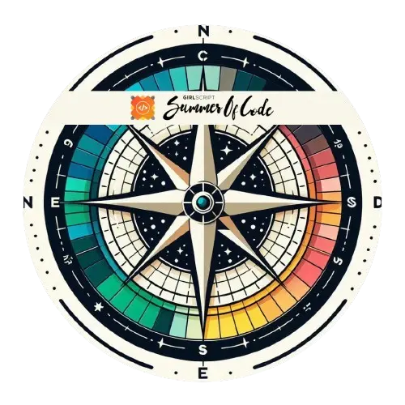

#  Hi Sayon Here                                                                                                     
       
**MERN Stack Developer || Electronics and Communication Engineering|| Data Structures and Algorithms Enthusiast**    

      

  

## 📈 Contribution Activity

  

## Connect with me

  
  &nbsp;&nbsp;&nbsp;&nbsp;

  
  &nbsp;&nbsp;&nbsp;&nbsp;

  
  &nbsp;&nbsp;&nbsp;&nbsp;

  
  &nbsp;&nbsp;&nbsp;&nbsp;

  
  &nbsp;&nbsp;&nbsp;&nbsp;

  
  &nbsp;&nbsp;&nbsp;&nbsp;

  
  &nbsp;&nbsp;&nbsp;&nbsp;

  
  &nbsp;&nbsp;&nbsp;&nbsp;

  
  &nbsp;&nbsp;&nbsp;&nbsp;

  
  &nbsp;&nbsp;&nbsp;&nbsp;

  

<!-- Snake Game Repo View -->

  

## Tech Stack

       
  
  
  
  
  
       
  
  
  
  
  
  
  
  
  
  
  
  
  
  
  
  
  
  
  
  
  
  
  
  
  
  
  
  
  
  

## 📊 GitHub Stats

  
  

  

## 🏅 Achievements

 
 
 

_"Turning ideas into clean, scalable code — one commit at a time"_

